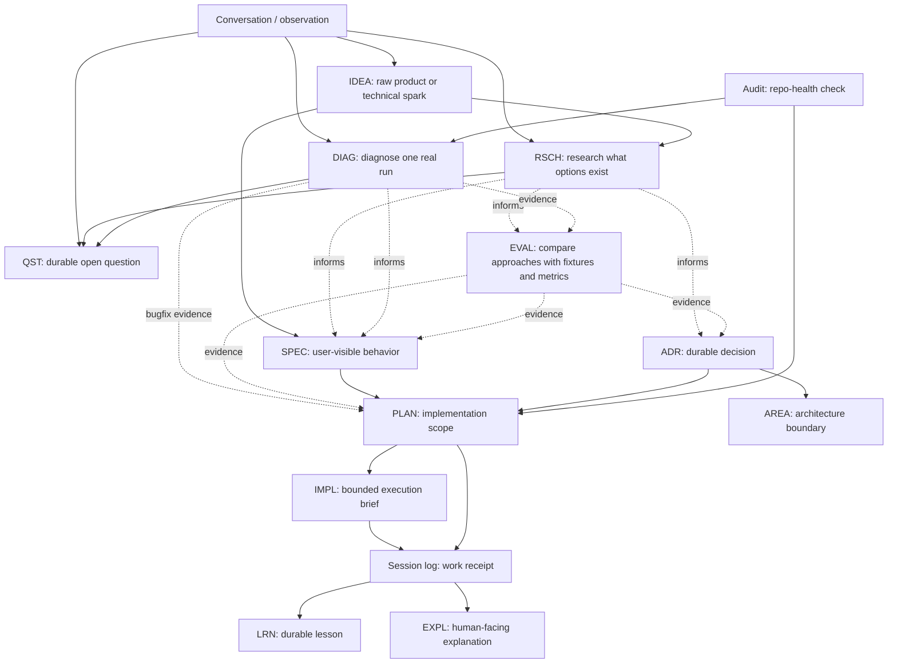

# Docs

Map of the documentation system.

## Start Here

1. `<orientation/CURRENT_STATE.md>` - current truth and fanout
2. `<orientation/ONBOARDING.md>` - non-code walkthrough
3. `<orientation/ROADMAP.md>` - sequence and rationale
4. `<orientation/ARCHITECTURE.md>` - architecture and decision provenance
5. `<architecture/README.md>` - architecture area registry and boundary map, if split out
6. `<IDEAS.md>` - global `IDEA-####` registry
7. `<SPECS.md>` - global `SPEC-####` registry
8. `<CONCEPTS.md>` - global `CONC-####` registry, if concept notes exist
9. `<EXPLAINERS.md>` - global `EXPL-####` registry, if explainers exist
10. `<QUESTIONS.md>` - global `QST-####` registry, if durable questions exist
11. `<LEARNINGS.md>` - global `LRN-####` registry, if learning records exist
12. `<product/specs/>`, `<architecture/specs/>`, or another topic-first specs folder
13. `<domain>/plans/` - plan folders and implementation briefs

## Top-Level Areas

| Area | Purpose |
|---|---|
| `orientation/` | Current state, onboarding, roadmap, architecture |
| `orientation/explainers/` | `EXPL-*` human-facing explanations and visual walkthroughs that are too detailed for onboarding |
| `architecture/` | Split architecture hub and `areas/AREA-*.md` boundary docs when one overview is too dense |
| `product/` | Product ideas, concept notes, specs, and plans |
| `decisions/` | ADRs, `LRN-*` learning records, `QST-*` questions, execution-readiness notes |
| `repo-health/` | Docs/workflow plans, repo-health audits, session logs, state history, CI/test hygiene |
| `research/` | Feasibility studies, spikes, findings |
| `operations/` | Release, production, app-store, manual checks |
| `marketing/` | Strategy, launch plans, campaign outputs |

## Doc Type Workflow

Use the smallest durable doc that answers the actual question. Stable IDs are handles, not required gates; a small idea can go straight to a spec, while uncertain or evidence-heavy work should pass through research, evaluation, or diagnostics first.

Evidence docs inform decisions; they do not replace them. `RSCH`, `EVAL`, and `DIAG` can feed a spec, ADR, or plan, but product behavior still belongs in `SPEC`, durable decisions still belong in `ADR`, and implementation scope still belongs in `PLAN`/`IMPL`.

Decision shortcut:

| Need | Use |
|---|---|
| Future-facing spark | `IDEA` |
| Sources or option landscape | `RSCH` |
| Fixtures, metrics, benchmark, bakeoff, or thresholds | `EVAL` |
| One real run timeline, crash, freeze, slow flow, or pasted logs | `DIAG` |
| User-visible behavior | `SPEC` |
| Durable architecture/product decision | `ADR` |
| Implementation boundaries and sequencing | `PLAN` |
| Bounded task execution | `IMPL` |
| Reusable human explanation | `EXPL` |
| Durable lesson | `LRN` |
| Durable unresolved question | `QST` |

## Rules

- Keep `CURRENT_STATE.md` short and link outward.
- Keep `IDEAS.md` as the global registry for one continuous `IDEA-####` sequence.
- Keep `CONCEPTS.md` as the global registry for one continuous `CONC-####` sequence when the repo uses concept notes.
- Keep `SPECS.md` as the global registry for one continuous `SPEC-####` sequence.
- Keep `EXPLAINERS.md` as the global registry for one continuous `EXPL-####` sequence when the repo uses explainers.
- Keep `QUESTIONS.md` as the global registry for one continuous `QST-####` sequence when the repo uses durable questions.
- Keep `LEARNINGS.md` as the global registry for one continuous `LRN-####` sequence when the repo uses learning records.
- Store specs in topic-first folders such as `product/specs/`, `architecture/specs/`, or `repo-health/specs/`.
- Put plans under the domain that owns the outcome.
- Use `sequence` frontmatter for roadmap order; keep `PLAN-*` IDs stable.
- Use repo-health audits for periodic docs, architecture, duplication/refactor, test, tooling, and paper-trail checkups.
- Use `RSCH-*` research surveys for sourced option landscapes, not repeatable bakeoffs or one failed run.
- Use `EVAL-*` evaluations for repeatable fixtures, metrics, thresholds, and bakeoffs.
- Use `DIAG-*` diagnostics for real-run failures, freezes, slow flows, crash logs, timing traces, and privacy-sensitive debugging evidence.
- Give each meaningful plan its own folder.
- Use session logs for per-session receipts.
- Use ADRs for durable cross-plan decisions.
- Use `CONC-*` notes for semi-mature domain models, taxonomy, ontology, naming, or source-of-truth sketches before they harden into specs, ADRs, plans, architecture docs, or explainers.
- Use `LRN-*` records for lessons learned, not routine session narration.
- Use `EXPL-*` docs for durable human-facing explanations; include visualization-pass-style diagrams when structure or flow is clearer visually.
- Use `QST-*` records only for durable unresolved questions that need status, ownership, links, or resolution history across sessions.
- Keep local open questions in the owning spec, plan, brief, research note, session log, explainer, or learning record until they need `QST-*` tracking or `TODO-*` ownership.
- If architecture is split, make `AREA-*` IDs match `docs/architecture/areas/AREA-*.md` filenames exactly.
